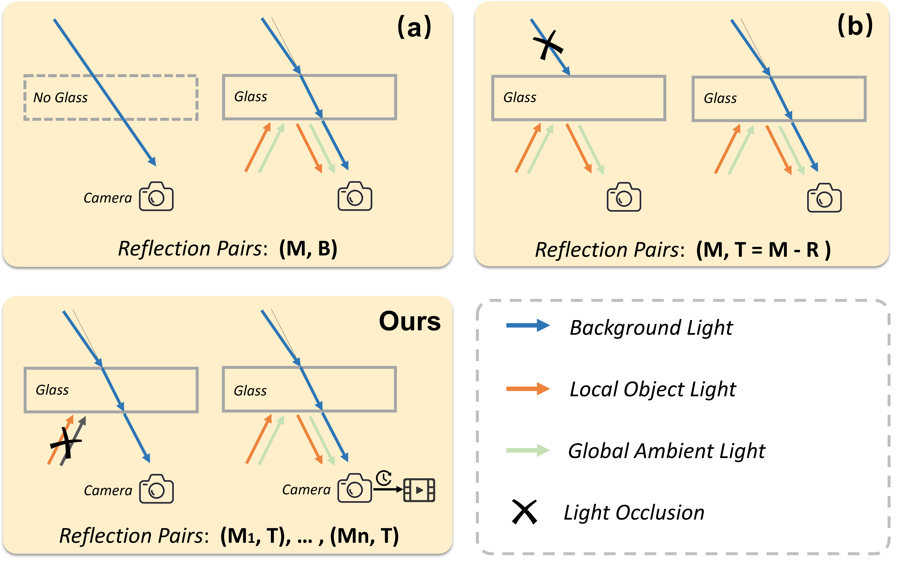

# Revisiting Singlelmage Reflection Removal in the Wild (CVPR 2024)

This is the official implementation of the CVPR 2024 paper [Revisiting Singlelmage Reflection Removal in the Wild](https://arxiv.org/abs/2311.17320).


## Collection Pipeline 

1. Simplified illustrations of existing pipelines for collecting real reflection pairs.
<p align=center></p>

2.  Illustration of our collection process with our proposed pipeline.
<p align=center></p>


##  Datasets 
Download Links:

1. Baidu disk: [here](https://pan.baidu.com/s/1PAnGuCv65VzV0qve9RXlOg?pwd=cvpr)  (Code: cvpr)

2. HuggingFace: [here](https://huggingface.co/datasets/zhuyr/RRW)

## Citation
If you find this work or code useful for your research, please cite:
```
@inproceedings{zhu2023Weather,
  title={Revisiting Singlelmage Reflection Removal in the Wild},
  author={Yurui Zhu and Xueyang Fu and Peng-Tao Jiang and  Hao Zhang and Qibin Sun and Jinwei Chen and Zheng-Jun Zha and Bo Li},
  booktitle={Proc. IEEE/CVF Conference on Computer Vision and Pattern Recognition (CVPR)},
  year={2024}
}

```

## Contact
If you have any questions, please contact zyr@mail.ustc.edu.cn
